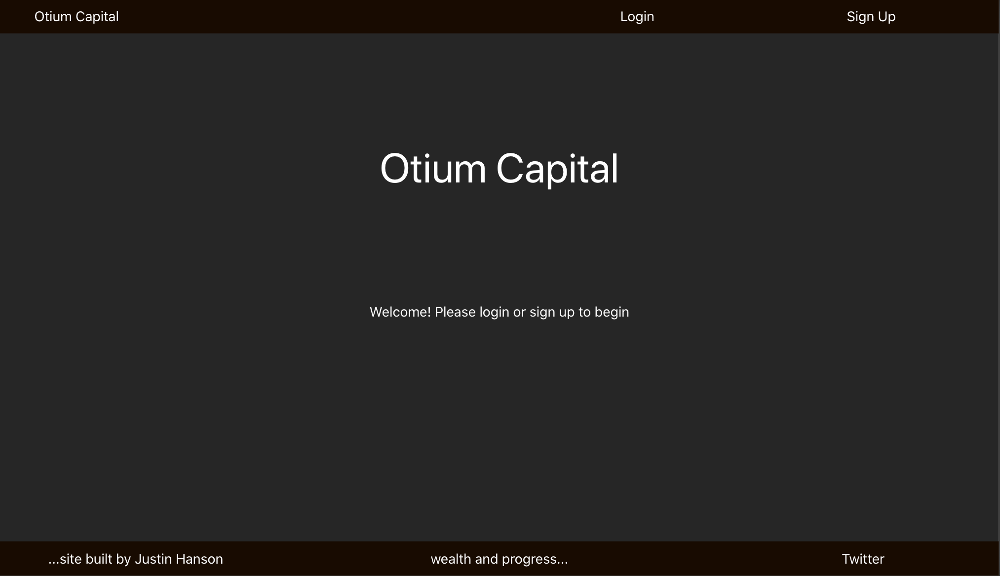
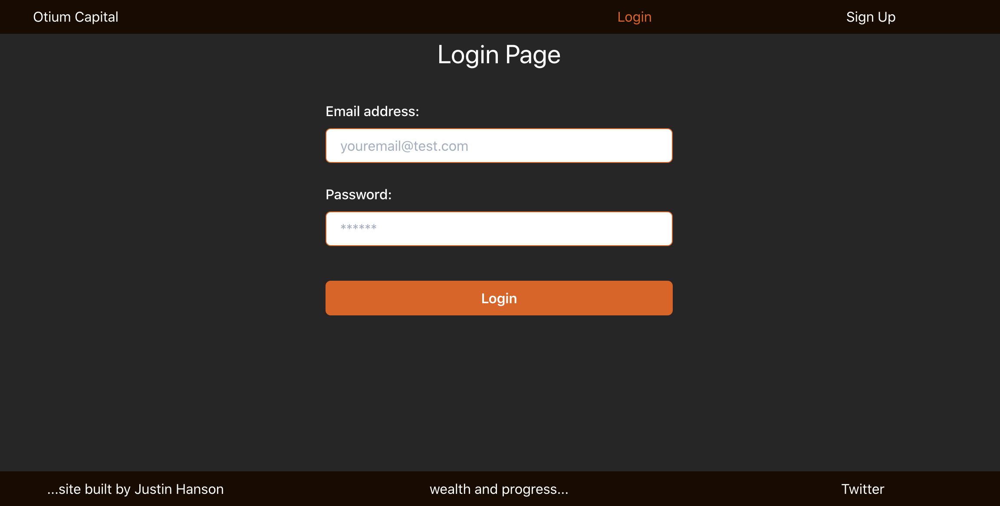
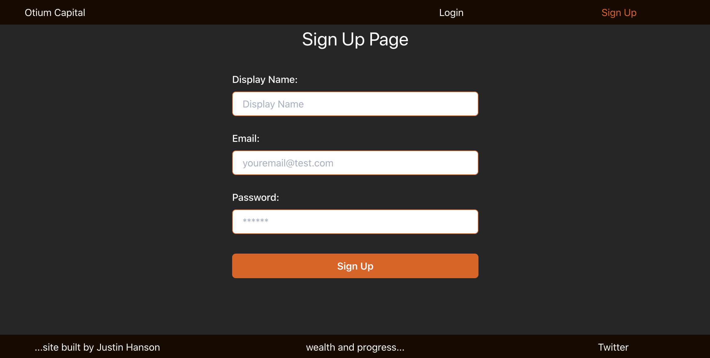
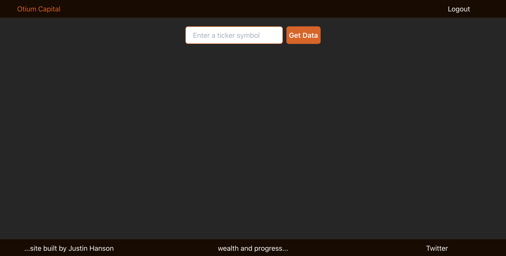
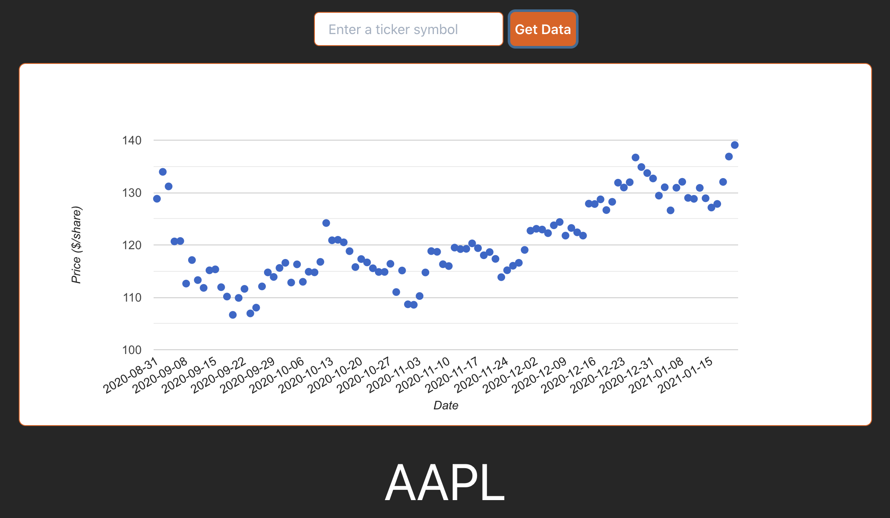
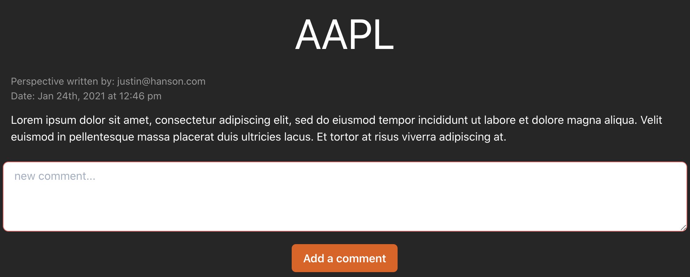
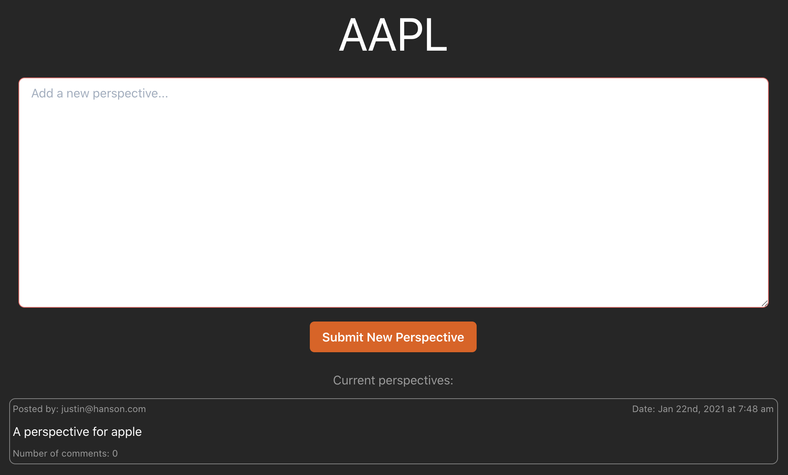

# Otium Capital  
[Otium](https://en.wiktionary.org/wiki/otium)
A community dedicated to freeing mental capital from stress and worries over money 
through collecting, generating, and sharing ideas for investing on a social media style platform 

## Table of Contents
[Installation Instructions](#installation)  
[How to use This Application](#how-to)
[Technologies Employed](#tech)  
[How to Contibute](#contribute)  
[License Information](#license)  
[Questions](#questions)  

## Installation
Access the web-based application deployed at the following link;
https://otiumcapital.herokuapp.com/

## How-To
1. Step 1: Login or Sign Up
	* Click the links in the navigation menu (upper right)
	* Fill out the corresponding form that is presented
	* Click the submit button  

 

2. Step 2: Explore
	* After logging in or signing up you are presented with a box to enter a Ticker symbol
	* Enter a Ticker Symbol for a company of interest to you
	* When you click the 'Get Data' button you will be presented with recent price data and 
	any perspectives others in the community have put forth
	* Consider searching companies such as 'AAPL', 'TSLA', 'BRK-A' at first to get aquainted with the application

 

3. Step: Contribute
	* After being presented with Data on a company, you can now contribute
	* The list of perspectives are clickable and when you click you will be taken to a new page 
	where you can read comments and/or submit your own by filling out the form
	* You can submit a new perspective by filling out the for presented under the price data  

 

## Technologies Employed
* The front end experience, CSS and responsive design was done with [Chakra-ui](https://chakra-ui.com/)
* [Node.js](https://nodejs.org/en/)
* [Express.js](https://expressjs.com/)
* [React](https://reactjs.org/)
* [Apollo](https://www.apollographql.com/)
* [MongoDB](https://www.mongodb.com/)
* [GraphQL](https://graphql.org/)
* [react-google-charts](https://react-google-charts.com/)
* [AlphaVantage](https://www.alphavantage.co/)

## Contribute
Please contact me through Github if you interesting in contributing.
The code repository is located here:
https://github.com/hansonjw/otium-capital

## License
No license is applicable for this application

## Questions
For questions, comments, suggestions, I can be reached at the following:  
- https://github.com/hansonjw  
- hansonjw@gmail.com

## Future Development
* Payment platform integration
* 3rd party authentication such as Google, etc.
* Enhanced social media style features such as likes and dislikes, up/down-voting, etc.

# Project Requirements

	Note: This code basae was submitted as part of the UC Berkely Coding Boot Camp.  Key assignment requirements are outlined below:

	* Use React for the front end.
	* Use GraphQL with a Node.js and Express.js server.
	* Use MongoDB and the Mongoose ODM for the database.
	* Use queries and mutations for retrieving, adding, updating, and deleting data.
	* Be deployed using Heroku (with data).
	* Meet the minimum requirements of a PWA:
		* Uses a web manifest
		* Uses a service worker for offline functionality
		* Is installable
	* Have a polished UI.
	* Be responsive.
	* Be interactive (i.e., accept and respond to user input).
	* Include authentication (JWT).
	* Protect sensitive API key information on the server.
	* Have a clean repository that meets quality coding standards (file structure, naming conventions, best practices for class and id naming conventions, indentation, high-quality comments, etc.).
	* Have a high-quality README (with unique name, description, technologies used, screenshot, and link to deployed application).
	​
	Finally, you must add your project to the portfolio that you created in Module 20.
	You should also consider the following suggestions to help your project stand out:
	​
	## CSS Styling
	​
	Instead of using a CSS library like Bootstrap, consider one of the following suggestions:
	​
	* Look into the concept of **CSS-in-JS**, which abstracts CSS to the component level, using JavaScript to describe styles in a declarative and maintainable way. Some popular libraries include [styled-components](https://styled-components.com/) and [Emotion](https://emotion.sh/docs/introduction).
	* Try using a component library, such as [Semantic UI](https://semantic-ui.com/), [Chakra UI](https://chakra-ui.com/), or [Ant Design](https://ant.design/).
	* Create all the CSS for your application just using CSS.
	Ultimately, it doesn't matter which of these options you choose&mdash;it just needs to look professional and be mobile-friendly.
	​
	## Payment Platform
	​
	Consider integrating the Stripe payment platform. Even if you don’t create an e-commerce application, you could set up your site to accept charitable donations.
	​
	**More details about the project will be provided in the lessons for Module 23 in Canvas.**

	Other Considerations:
	Also, re the requirements and JWT: I would prefer if you used JWT’s in the context of evaluating someone else’s JWTs and not rolling your own for authentication.  In my long-winded lecture last Monday, I tried to explain why JWTs are not often a great solution for implementing authentication in your application, but they are a great way for you to implement someone else’s authentication in your app.  For example, a great way to implement a login portal in your app would be by using Google Sign On: you will have to read their documentation and struggle through their website instructions (https://developers.google.com/identity/sign-in/web/backend-auth).
	BONUS CHALLENGE: benchmark using JWTs for authentication in your app vs. a simple session-based login (e.g. via a session identifier) for your authentication.  Which is faster?  Which requires more bandwidth?  How would you test this?

	## Presentation Requirements
	Your group will give a 10-minute presentation on your project, with about 7 minutes devoted to the presentation itself, followed by a 3-minute Question & Answer session. Use this Project Presentation Template (Links to an external site.) to address the following:

	* Elevator pitch: A one-minute description of your application.
	* Concept: What is your user story? What was your motivation for development?
	* Process: What technologies did you use? How did you break down and assign tasks and roles? What challenges did you encounter? What were your successes?
	* Demo: Show your stuff!
	* Directions for future development.
	* Links to the deployed application and the GitHub repository.

